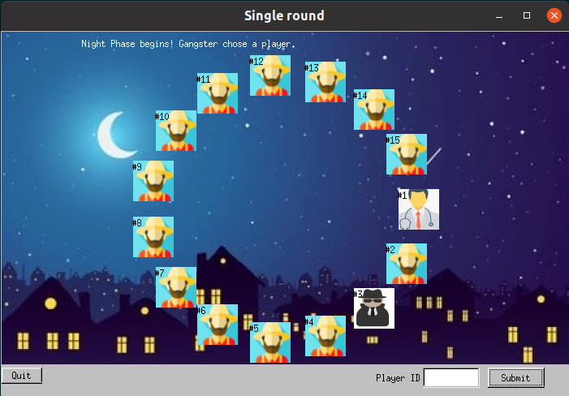

## CS-150 Assignments, Fall 2022-2023
Course webpage: [CS-150](https://www.csd.uoc.gr/CSD/index.jsp?content=courses_catalog&openmenu=demoacc3&lang=gr&course=10)

The first three assignments implement a simplified version of the game **“Town of Salem”**.
The provided text contains a few grammatical errors and awkward phrasings. Here's a corrected version:

The fourth assignment is an implementation of OOP fundamentals.
## Game Description

- In this game, 7 players participate, each with a role. The roles are:
  1. Citizen
  2. Doctor
  3. Gangster

- At the beginning of the game, a role is assigned to each player randomly. There is one doctor, one gangster, and the rest are citizens.

- The game is split into 2 phases: day and night.

- During the night phase, the citizens are "asleep," and the gangster selects which player has to leave (lose).

- Then, the doctor decides which player to save from the gangster. If the doctor selects the same player that the gangster chose, the player is saved, and they do not lose. At the end of the night, it is announced which player lost (if any).

- In the day phase, the players vote for one of the remaining players to leave the game. The player with the most votes loses.

- The cycle of day and night repeats until the gangster loses or all the players lose.

- If the gangster loses while there are still players left, the citizens win. If there are two players left, and one of them is the gangster, the gangster wins.

## Compiling
Each assignment contains a `CMakeLists.txt` file that can be used with `cmake`.

---
